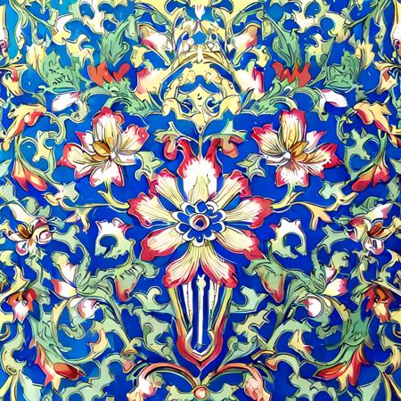
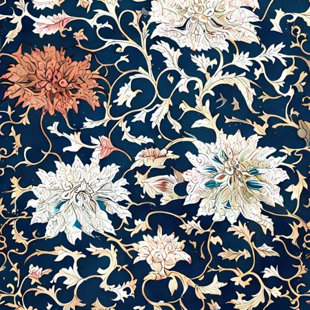

# TJISE Spring term 2023 Homework #1丽丽家人组

## 参考资源

| 名称                                                         | 备注                                                         |
| ------------------------------------------------------------ | ------------------------------------------------------------ |
| [Google Search: next js spring boot](https://www.google.com/search?q=next+js+springboot&newwindow=1&ei=Pf52ZLyWJeSK0PEPt_6wgAY&ved=0ahUKEwj8qJ6Hi5__AhVkBTQIHTc_DGAQ4dUDCBA&uact=5&oq=next+js+springboot&gs_lcp=Cgxnd3Mtd2l6LXNlcnAQAzIHCAAQDRCABDIHCAAQDRCABDIGCAAQHhANMggIABAIEB4QDTIICAAQigUQhgMyCAgAEIoFEIYDMggIABCKBRCGAzIICAAQigUQhgM6CggAEEcQ1gQQsAM6EAguEIoFEMcBENEDELADEEM6CggAEIoFELADEEM6DQgAEIoFELEDEIMBEEM6BwgAEIoFEEM6CAgAEIoFEJECOgUIABCABDoGCAAQFhAeSgQIQRgAUOgEWIwkYKIpaAFwAXgAgAHbBYgBhSOSAQsyLTMuNy4wLjEuMZgBAKABAcABAcgBCg&sclient=gws-wiz-serp) |                                                              |
| [Youtube: Full Stack Spring Boot + Next.js Tutorial](https://www.youtube.com/watch?v=Z_4Tqmv8Oa4) | 这里作者有一个文档网站似乎很有帮助<br />[Full Stack Book - backend](https://www.fullstackbook.com/backend/tutorials/springboot-todo/)<br />[Full Stack Book - frontend](https://www.fullstackbook.com/frontend/tutorials/nextjs-todo/) |
| [Youtube: Part 1 : FullStack Application Spring Boot NextJs](https://www.youtube.com/watch?v=_aHGjkOyVso) | Book Store                                                   |
|                                                              |                                                              |
|                                                              |                                                              |

## Prompt Collection

| name                                                         | desc            |
| ------------------------------------------------------------ | --------------- |
| [Stable Diffusion Prompt Book](https://cdn.openart.ai/assets/Stable Diffusion Prompt Book From OpenArt 10-28.pdf) | OpenArt PDF     |
| [StableDiffusion Prompt Wiki](https://www.reddit.com/r/StableDiffusion/wiki/tutorials) | Reddit article  |
| [/r/PromptSharing on Reddit](https://www.reddit.com/r/PromptSharing/) | Reddit topic    |
| [Leaning Prompting](https://learnprompting.org/zh-Hans/docs/Images/resources) |                 |
| [Prompt Builder](https://promptomania.com/stable-diffusion-prompt-builder/) | 风格化提示 分类 |
| https://publicprompts.art/                                   | Prompt 来源     |
| https://playgroundai.com/                                    | Prompt 来源     |
| https://lexica.art/                                          | Prompt 来源     |
| https://promptbase.com/                                      | 参考售卖内容    |
| Danbooru 标签超市https://tags.novelai.dev/                   | 风格化提示 分类 |
| [wallpaper site](https://rare-gallery.com/1051032-abstract-lsd-bright-trippy-color-flower-psychedelic-art.html) | 抽象图片        |

## Prompts

| Model                                                        | Example                                                      | Prompt                                                       | Negative Prompt | pixel | steps | Scale | Sampler           | Seed |
| ------------------------------------------------------------ | ------------------------------------------------------------ | ------------------------------------------------------------ | --------------- | ----- | ----- | ----- | ----------------- | ---- |
| [cjwbw/analog-diffusion](https://replicate.com/cjwbw/analog-diffusion) |                                                              | peasant and dragon combat, wood cutting style , viking era, bevel with rune | blur haze       | 512   | 20    | 7     | K_EULER_ANCESTRAL | -1   |
|                                                              |  | seaside tail train rural japan, a collage painting, in the style of wes anderson, lola dupre, david hockney, isolated on negative white space background dark monochrome fluorescent spraypaint accents volumetric octane render, not double decker |                 |       |       |       |                   |      |
|                                                              |  | Japan crafts explorations, a poster design for a contemporary graphic design exhibition, by Rene Magritte, Andy Warhol, Alex Yanes, Tadanori Yokoo, Yoshio Awazu |                 |       |       |       |                   |      |
|                                                              |  | The Monkey in a General's Uniform riding a charging ram into battle |                 |       |       |       |                   |      |
|                                                              |  | abstract, LSD, bright, trippy, color, flower, psychedelic art |                 |       |       |       |                   |      |
|                                                              |  | teenage mutant ninja turtles meet the beastie boys, painted by van gogh |                 |       |       |       |                   |      |


## Model

| Name                               | Image                                                        | Desc    | Link                                                         |
| ---------------------------------- | ------------------------------------------------------------ | ------- | ------------------------------------------------------------ |
| Chinese traditional pattern        |  | LYCORIS | https://civitai.com/models/29858/chinese-traditional-pattern |
| Ukiyo-e FuYue Style Background-Mix |                           | LORA    | https://civitai.com/models/25222/ukiyo-e-fuyue-style-background-mix |
|                                    |                                                              |         | https://replicate.com/ai-forever/kandinsky-2                 |


## 设计资源

| 名称                                                         | 介绍           |
| ------------------------------------------------------------ | -------------- |
| [Open peeps](https://www.openpeeps.com/)                     | 默认头像库     |
| [shadcn/ui - Login Page](https://ui.shadcn.com/examples/authentication)<br />[shadcn/ui - Music](https://ui.shadcn.com/examples/music)<br />[shadcn/iu - Cards](https://ui.shadcn.com/examples/cards) | 页面模板       |
| [Art History Muse](https://www.planktonacademy.com/courses/history-muse-art-history-course-online) | 油画/美术馆    |
| [rijksmuseum](https://www.rijksmuseum.nl/nl)                 | 荷兰国立博物馆 |


## 角色

买家、管理员

## 基本功能

### 用户

| 功能           | 描述                                                         | 状态 |
| -------------- | ------------------------------------------------------------ | ---- |
| 用户注册和登录 | 允许买家创建账户并进行登录                                   |      |
| 商品浏览和搜索 | 显示商品目录和分类，提供搜索功能                             |      |
| 商品详情       | 展示商品详细信息，包括名称、价格、描述、图片等               |      |
| 购物车功能     | 允许买家添加、修改和移除购物车中的商品                       |      |
| 下单和支付     | 提供下单功能，选择商品和数量，并完成支付流程                 |      |
| 订单管理       | 显示买家的订单列表和订单详情，包括状态、商品清单、配送信息等 |      |
| 用户评价和评论 | 允许买家对购买过的商品进行评价和评论                         |      |
| 个人信息管理   | 允许买家修改个人资料、管理订单历史记录和收货地址             |      |
| 优惠和促销     | 展示促销活动和优惠券信息，支持使用优惠券或促销代码           |      |
| 售后服务       | 提供售后支持渠道，处理退款、退货和售后投诉等请求             |      |

### 管理员

| 功能           | 描述                                             | 状态 |
| -------------- | ------------------------------------------------ | ---- |
| 商品管理       | 添加、编辑和删除商品，管理分类、标签和库存       |      |
| 订单管理       | 查看和更新订单状态，处理退款、退货和售后投诉     |      |
| 用户管理       | 查看用户列表和详细信息，管理用户权限             |      |
| 库存管理       | 实时跟踪库存情况，设置库存警报                   |      |
| 数据分析和报告 | 生成销售报告和统计数据，分析用户行为和购买模式   |      |
| 售后管理       | 处理退款、退货和售后投诉请求                     |      |
| 广告和促销管理 | 管理广告位和促销活动，设置促销代码和优惠券       |      |
| 审核和权限管理 | 审核评价和评论，管理管理员权限                   |      |
| 系统设置       | 配置网站基本信息，管理系统全局设置               |      |
| 安全和日志管理 | 管理员身份验证和权限控制，记录关键操作和异常日志 |      |

## 主要模块

| 模块  | 参考资料                                                     |
| ----- | ------------------------------------------------------------ |
| 后端  |                                                              |
| 前端  |                                                              |
| CI/CD | [1] [Google Search: SpringBoot project ci/cd](https://www.google.com/search?q=springboot+project+ci%2Fcd&sourceid=chrome&ie=UTF-8)<br />[2] [Applying CI/CD With Spring Boot](https://www.baeldung.com/spring-boot-ci-cd)<br />[3] [Step by step guide to build CI/CD Pipeline for Spring Boot Microservices](https://medium.com/@contactkumaramit9139/step-by-step-guide-to-build-ci-cd-pipeline-for-spring-boot-microservices-33ddb545f95c) |

## 数据模型

用户、商品、订单

| id   | SKU   | name           | Cover  image                                                 | desc                | prompt                                                       | negative prompt | pixel dimensions | num outputs | step | guidance scale | seed | model                                                        | Scheduler |
| ---- | ----- | -------------- | ------------------------------------------------------------ | ------------------- | ------------------------------------------------------------ | --------------- | ---------------- | ----------- | ---- | -------------- | ---- | ------------------------------------------------------------ | --------- |
|      | #0001 | 迷幻的波普艺术 |  | Psychedelic Pop art | Hypnotic illustration of a Halloween pumpkin, hypnotic psychedelic art by Dan Mumford, pop surrealism, dark glow neon paint, mystical, Behance |                 | 512X512          | 1           | 25   | 13             |      | [stability-ai](https://replicate.com/stability-ai)/stable-diffusion | DDIM      |


## 技术架构

| 模块  | 名称           | 简介 |
| ----- | -------------- | ---- |
| 后端  | SpringBoot     |      |
|       | SpringSecurity |      |
| 前端  |                |      |
| CI/CD |                |      |

# Responses

```
{"id":"hf7exxxxxxxxxraxury","version":"dbxxxxxxxxxxxxxxxxx082a930b0c49861f96d1e5bf","input":{"guidance_scale":7,"height":512,"num_inference_steps":116,"prompt":"teenage mutant ninja turtles meet the beastie boys, painted by van gogh","sampler":"K_EULER","seed":-1,"width":512},"logs":"Using seed: -1\ninput_shape: torch.Size([1, 77])\n  0%|          | 0/116 [00:00\u003c?, ?it/s]\n  2%|▏         | 2/116 [00:00\u003c00:06, 18.37it/s]\n  3%|▎         | 4/116 [00:00\u003c00:06, 17.54it/s]\n  6%|▌         | 7/116 [00:00\u003c00:05, 19.43it/s]\n  9%|▊         | 10/116 [00:00\u003c00:05, 20.26it/s]\n 11%|█         | 13/116 [00:00\u003c00:04, 20.65it/s]\n 14%|█▍        | 16/116 [00:00\u003c00:04, 20.87it/s]\n 16%|█▋        | 19/116 [00:00\u003c00:04, 21.03it/s]\n 19%|█▉        | 22/116 [00:01\u003c00:04, 21.16it/s]\n 22%|██▏       | 25/116 [00:01\u003c00:04, 21.27it/s]\n 24%|██▍       | 28/116 [00:01\u003c00:04, 21.35it/s]\n 27%|██▋       | 31/116 [00:01\u003c00:03, 21.40it/s]\n 29%|██▉       | 34/116 [00:01\u003c00:03, 21.40it/s]\n 32%|███▏      | 37/116 [00:01\u003c00:03, 21.43it/s]\n 34%|███▍      | 40/116 [00:01\u003c00:03, 21.41it/s]\n 37%|███▋      | 43/116 [00:02\u003c00:03, 21.42it/s]\n 40%|███▉      | 46/116 [00:02\u003c00:03, 21.46it/s]\n 42%|████▏     | 49/116 [00:02\u003c00:03, 21.48it/s]\n 45%|████▍     | 52/116 [00:02\u003c00:02, 21.49it/s]\n 47%|████▋     | 55/116 [00:02\u003c00:02, 21.48it/s]\n 50%|█████     | 58/116 [00:02\u003c00:02, 21.50it/s]\n 53%|█████▎    | 61/116 [00:02\u003c00:02, 21.51it/s]\n 55%|█████▌    | 64/116 [00:03\u003c00:02, 21.53it/s]\n 58%|█████▊    | 67/116 [00:03\u003c00:02, 21.52it/s]\n 60%|██████    | 70/116 [00:03\u003c00:02, 21.54it/s]\n 63%|██████▎   | 73/116 [00:03\u003c00:01, 21.54it/s]\n 66%|██████▌   | 76/116 [00:03\u003c00:01, 21.52it/s]\n 68%|██████▊   | 79/116 [00:03\u003c00:01, 21.51it/s]\n 71%|███████   | 82/116 [00:03\u003c00:01, 21.52it/s]\n 73%|███████▎  | 85/116 [00:04\u003c00:01, 21.49it/s]\n 76%|███████▌  | 88/116 [00:04\u003c00:01, 21.49it/s]\n 78%|███████▊  | 91/116 [00:04\u003c00:01, 21.48it/s]\n 81%|████████  | 94/116 [00:04\u003c00:01, 21.47it/s]\n 84%|████████▎ | 97/116 [00:04\u003c00:00, 21.44it/s]\n 86%|████████▌ | 100/116 [00:04\u003c00:00, 21.43it/s]\n 89%|████████▉ | 103/116 [00:04\u003c00:00, 21.39it/s]\n 91%|█████████▏| 106/116 [00:04\u003c00:00, 21.38it/s]\n 94%|█████████▍| 109/116 [00:05\u003c00:00, 21.39it/s]\n 97%|█████████▋| 112/116 [00:05\u003c00:00, 21.41it/s]\n 99%|█████████▉| 115/116 [00:05\u003c00:00, 21.39it/s]\n100%|██████████| 116/116 [00:05\u003c00:00, 21.29it/s]\n","output":["https://replicate.delivery/pbxt/uQoqQWkhFxxxxxxxxxx3aHxFRA/out-0.png"],"error":null,"status":"succeeded","created_at":"2023-06-14T06:36:05.18155Z","started_at":"2023-06-14T06:36:05.19598Z","completed_at":"2023-06-14T06:36:11.596211Z","metrics":{"predict_time":6.400231},"urls":{"cancel":"https://api.replicate.com/v1/predictions/hf7em5jbkkxxxxury/cancel","get":"https://api.replicate.com/v1/predictions/hf7em5jxxxxxxxxxxxxxxxxy"}}

```


## API 设计

RESTful API

## 日志与错误处理

- 实现日志记录机制，记录关键操作和异常情况，以便进行故障排查和监控。
- 定义适当的错误处理和异常处理机制，提供友好的错误信息给用户，并记录异常以进行分析和修复。

## 监控和分析

- 实现日志记录机制，记录关键操作和异常情况，以便进行故障排查和监控。
- 定义适当的错误处理和异常处理机制，提供友好的错误信息给用户，并记录异常以进行分析和修复。

# Progress

登录，首页，详情页，支付，订单

### To Do

Operating without foreign key constraints

https://planetscale.com/docs/learn/operating-without-foreign-key-constraints#on-delete-cascade

Serverless mail service (CloudFlare Workers)

https://resend.com/
